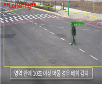
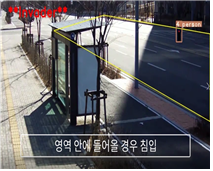
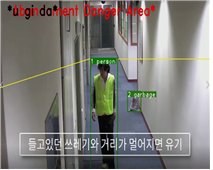

# Yolov5 + Deep Sort with PyTorch
# 이상행동 감지 기능 구현
# 웹으로 구현한 서비스는 -> https://github.com/qweasx10/flask-tracker2

# 실행방법
1. pycharm을 설치
2. anaconda prompt 창켜서 가상환경 만든다 conda create -n 원하는이름 python=3.8
3. conda activate 만든가상환경이름
4. 파이참으로 넘어와서 만든 가상환경 open해주고 settings 들어가서 python interpreter누르고 우측상단에 설정모양 누르고 add누르고 conda enviroment 누르고 existing enviroment 누르고 가상환경안의 python 선택 후 저장
5. 이제 터미널 창에 git clone https://github.com/qweasx10/tracker2.git
6. 그후 cd Yolov5_DeepSort_Pytorch
7. 그후 pip install -r requirements.txt
8. 그리고 cuda 설치 conda install pytorch torchvision torchaudio cudatoolkit=10.2 -c pytorch
9. 실행파일이 2개 있는데 tracker.py는 기존 Invade.py는 침입임 
10. 실행해보자 python 원하는파일.py --device 0 --source 0 --show-vid --save-txt
11. --device 0(gpu 사용한다는거) --source 0(캠) or 파일이름.mp4(이러면 저장된 비디오 재생) --show-vid(모니터링) --save-txt(결과 텍스트파일로 저장)

# 실행예시

  

 

   

 

